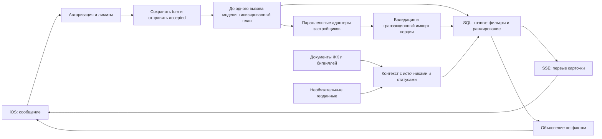

# Архитектура Meken

## Стек и границы

**Swift 6 + SwiftUI, iOS 18+.** Нативная навигация, доступность и системная работа с сетью/Keychain. Состояние UI изолировано `@MainActor`, сетевой клиент — `actor`, контрактные значения `Sendable`. В ядре приложения нет сторонних зависимостей. Foundation, MapKit и SwiftData достаточны для текущего поведения.

**Kotlin + Jetpack Compose, Android 8+.** Отдельный нативный клиент `/v1`. Чистый JVM `core` хранит контракт, SSE и reducer; repository владеет сетевыми/локальными данными; ViewModel публикует immutable StateFlow, Compose подписывается с учётом lifecycle. Сессия шифруется Android Keystore и исключена из backup/device transfer. Клиенты разделяют серверный контракт, а не UI-код. Проверенные границы: [MOBILE_ARCHITECTURE.md](MOBILE_ARCHITECTURE.md); сборка: [android/README.md](../android/README.md).

**Python 3.12 + FastAPI + Pydantic 2 + SQLAlchemy 2.0 + asyncpg.** Основная нагрузка — ожидание сетевых источников и запросов БД. Асинхронный сервер естественно обслуживает её; Python упрощает работу с ИИ и обработкой данных. Модульный монолит и отдельный процесс worker дают простой старт эксплуатации. API и worker можно масштабировать отдельно. При реальной CPU-нагрузке отдельная обработка выделяется по границе сервиса; переписывать мобильный клиент для этого не нужно.

**PostgreSQL** — оперативная проекция каталога и пользовательское состояние. **Redis** — межпроцессные лимиты/блокировки, не единственное хранилище диалогов. Полнотекстовый RAG использует PostgreSQL. Для структурированных квартир векторная БД и embeddings не нужны: точная цена, наличие и комнаты требуют фильтров, а не семантического сходства. Для большого корпуса документов можно позже добавить pgvector к слою retrieval. Нельзя честно гарантировать отсутствие будущих изменений: рост требований проверяется измерениями.

## Путь запроса

Создание диалога и сообщения имеют отдельные сохраняемые клиентские UUID. История читается страницами по стабильному cursor. Recovery-код открывает независимую сессию того же пользователя; новые функции объявлены capabilities для совместимости со старым сервером. Подробности, подписи и границы выкатки зафиксированы в MOBILE_ARCHITECTURE.md.

Результаты в SSE — **замена текущей подборки** по стабильным ID, а не бесконечное добавление дублей. После изменения цены/статуса неподходящая квартира исчезает из поиска; сохранённая остаётся читаемой с новым статусом. Первые карточки могут происходить из проекции каталога. Их время/статус объясняют границу актуальности; приложение не называет их бронированием.

## Актуальность и отказоустойчивость

- ID = UUIDv5 от `(provider_id, external_id)`. Разные застройщики не объединяются по похожему адресу или названию. Для настоящей межисточниковой дедупликации нужен надёжный идентификатор помещения.
- `observed_at` — время наблюдения источника, `received_at` — время получения. В BI используется HTTP Date с вычитанием Age, а не произвольное обновление даты при повторной отдаче из БД.
- Более старое наблюдение не перезаписывает более новое. В PostgreSQL транзакция блокирует строку источника на время импорта, каждый параллельный запрос имеет отдельную `AsyncSession`.
- Полная согласованная выгрузка может отметить отсутствующие помещения как `unknown`. Ошибка, обрыв страницы и обычный поисковый ответ не доказывают продажу. Пустая полная выгрузка требует явного `allow_empty`.
- Из общего поиска исключаются `sold`, `reserved`, `unknown` и сведения старше предельного возраста. «Свободно» всё равно является утверждением поставщика на определённый момент.
- Ограничены соединения, размер ответа, страницы, время запросов и общий turn. Есть circuit breaker и краткое подавление одинаковых запросов. Отмена потока отменяет задачи источников и освобождает lease.
- События сохраняются до отправки. Повтор сообщения с тем же ключом читает сохранённый ответ, а не повторяет ИИ/внешние запросы. Незавершённый turn возвращает `pending`; зависший после падения процесса становится `interrupted`.
- Redis недоступен: новые затратные операции прекращаются/возвращают ошибку. В production нет молчаливого перехода на лимиты одного процесса.

## Контекст и ИИ

Модель не получает SQL-доступ, произвольный HTTP tool, ключи застройщиков или возможность бронирования. Она возвращает проверяемый `Decision`: действие и предпочтения. Harness выполняет только известные операции чтения. На сообщении допускается не более двух model calls, включая RAG-подбор свидетельств. По умолчанию лимит — 40 calls на пользователя и 2000 на весь сервис в сутки; изменяется конфигурацией. `store=False`, ограниченные вход/выход, timeout, отсутствие скрытых SDK-retries, учёт токенов.

Рабочая память — типизированные предпочтения и IDs предыдущей подборки. «Первая квартира» разрешается относительно реально показанных карточек. В историю не отправляется весь каталог. Общие ответы выбираются из неистёкших материалов; цитата и URL принадлежат сохранённому источнику. Модель может выбрать только существующий ID материала. Неподтверждённые цены, процентные ставки и обещания о школе не генерируются свободным текстом.

Базовый режим без модели понимает ограниченный набор русских выражений и не заменяет полноценный языковой ИИ. При неоднозначности суммы (взнос/месячный платёж/валюта) задаётся вопрос. При нехватке подтверждённых фактов система сообщает об этом. Сложные диалоги нужно оценить с реальным провайдером модели до публичного релиза.

## Инфраструктура

В отличие от наличия помещения, сведения о школе относятся к **ЖК или бигвиллю**. `ProjectFact` хранит scope, состояние, имя, цитату, источник, время и ожидаемый срок. `ContextDocument` сохраняет версию даже при удалении всех фактов из документа, поэтому старый текст не может вернуть удалённую школу.

`planned` и `under_construction` не проходят фильтр действующей школы рядом. Принадлежность бигвиллю не означает подтверждённое расстояние от каждого корпуса. Геометрическое расстояние рассчитывается только при наличии координат. Фильтр «в ЖК» или «в бигвилле» может опираться на действующий объект, прямо указанный застройщиком, без OSM и координат. Фильтр «рядом по расстоянию» требует координаты; принадлежность бигвиллю его не заменяет.

OSM — опциональный импорт, отдельно от поискового пути. Источник может отставать от новых проектов; отсутствие записи не превращается в отрицательный факт. OSM не блокирует выдачу квартир. Карта содержит атрибуцию. Для коммерческого регулярного использования нужен подходящий поставщик/свой endpoint и соблюдение условий данных.

## Основные источники технических решений

- [SwiftUI Observation](https://developer.apple.com/documentation/swiftui/managing-model-data-in-your-app)
- [SQLAlchemy: concurrent AsyncSession](https://docs.sqlalchemy.org/en/20/orm/extensions/asyncio.html#using-asyncsession-with-concurrent-tasks)
- [FastAPI StreamingResponse](https://fastapi.tiangolo.com/advanced/custom-response/)
- [OpenAI Structured Outputs](https://developers.openai.com/api/docs/guides/structured-outputs)
- [Публичная схема BI Group](https://apigw.bi.group/sales-picker/v3/api-docs)
