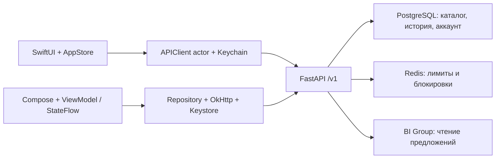

# Мобильная архитектура и выпуск Meken

Проверено 4 октября 2026 года. iOS сохранён на SwiftUI, Android добавлен на Kotlin / Jetpack Compose к общему `/v1` API. Исходные изменения развёртывания сохранены. Production-база и работающий сервер этой задачей не изменялись.

## Итог и адрес Release

Найденные ошибки состояния, сети, восстановления и контрактов исправлены в коде. Подготовлены подписанные Android APK/AAB и iOS IPA для App Store Connect. Публикация в магазинах не выполнялась.

**Release обеих платформ использует только `https://194.238.43.134`.** Android имеет константу production BuildConfig и отдельное Debug-переопределение. iOS закрепляет адрес в Release settings и runtime. Попытки сборки с `https://wrong.meken.invalid` проверены: обе отклонены.

Новый backend пока не выкатан: необходимы свежая отдельно сохранённая production-копия и проверка восстановления/миграций. Automatic approval отклонил экспорт полного dump на Mac без прямого разрешения пользователя. Сохранены только read-only метаданные; dump отсутствует. Клиенты читают capabilities: старый API использует совместимый контракт, неподдержанная recovery-функция не показывается.

## Исправленные замечания

| Проблема | Решение |
|---|---|
| Истёкший refresh блокировал старт | Явное восстановление по коду или новая сессия; временная ошибка сети не стирает профиль. |
| Поздний send/replay/restore попадал в другой диалог | Поколения аккаунта/поиска, отменяемые задачи, центральные busy gates. |
| Поздний GET избранного/истории отменял изменение | Ревизии чтения и мутаций; устаревший ответ не записывается в UI/кеш. |
| Обрыв до accepted терял UUID и повторял запрос | Snapshot до POST, X-Turn-ID, прежнее тело/UUID, sequence deduplication. |
| Создание диалога имело неопределённый результат | Durable первый запрос, client_conversation_id, immutable preferences hash, per-user uniqueness и транзакционная защита повторов. |
| История обрезалась 30 сообщениями | Полная пагинация обеих платформ, стабильный cursor при равных timestamp. Старые страницы не заменяют текущие карточки/фильтры/replay cursor. |
| Лимит диалогов не имел выхода в UI | Подтверждаемое удаление отдельных диалогов. |
| Офлайн-кеш блокировал reconnect | Отдельное состояние подключения, чтение сохранённых квартир, повтор инициализации. |
| Кеш/request не имели владельца | Endpoint/user scope; чужие данные не появляются после смены/удаления профиля. |
| Android одновременно закрывал и читал body | Watcher отменяет Call, body закрывается после выхода читателя. Шесть HTTP1/HTTP2 cancellation сценариев. |
| Старый expiry marker переживал recovery | Привязка marker к прежнему token hash; атомарная новая пара не отвергается старым флагом. |
| Не было восстановления/общего избранного | Код открывает независимую сессию того же пользователя. Профили не объединяются и не удаляются автоматически. |
| Recovery/refresh/worker конфликтовали | Единый порядок блокировок, revalidation, активность продлевает окно аккаунта; старые данные удаляются по retention. |
| OpenAPI не описывал часть контракта | Типизированы history/conversation, SSE payloads, ошибки, профиль/capabilities; snapshot сверяется тестом. |
| Подпись и Release URL оставались неопределёнными | Android upload key, проверенные APK/AAB и App Store IPA, фиксированный production URL. |

Главные места: `ios/Meken/Core`, `ios/MekenCore`, `android/app/data`, `android/app/ui`, `android/core`, `backend/app/services/conversations.py`, `backend/app/api/recovery.py`, миграции 0007/0008.

## Архитектура и хранение

- Бизнес-правила, цена, наличие, инфраструктура, лимиты/затраты ИИ принадлежат серверу. Клиенты отображают данные, сохраняют сессию/кеш и восстанавливают запросы.
- Сессии устройств независимы; refresh не отключает другое устройство того же профиля. Recovery сохраняет новые токены до замены локального профиля; ошибка сохраняет прежние credentials.
- Код доступа — повторно используемый машинный секрет с 256 битами случайности, сервер хранит SHA-256. Выдаётся один раз при создании/ротации. Любой владелец кода читает историю/избранное. UI объясняет это и не сохраняет код обычным текстом.
- iOS защищает выдачу LocalAuthentication; Android запрещает screenshots диалога и отмечает clipboard sensitive. Код очищается при закрытии/фоне. Смена кода прекращает работу прежнего кода.
- Хранение не бесконечно: активность аккаунта имеет окно 90 дней, сообщения — собственную политику удаления. Без кода и действующей сессии анонимный профиль не восстановить.
- Android token/pending/cache: AES-GCM/Keystore, AtomicFile, noBackupFilesDir, исключение backup/device transfer. iOS: Keychain ThisDeviceOnly, scoped SwiftData.
- SSE listings заменяет выдачу; replay — снимок с возможным pending. Только done=complete означает успех.
- Android деньги Long до 10 млрд, bounded SSE/UTF-8/CRLF. Внешние URL только HTTPS без credentials; Authorization не переносится redirect.

Источники: [Android architecture](https://developer.android.com/topic/architecture/recommendations), [AGP compatibility](https://developer.android.com/build/releases/agp-8-13-0-release-notes), [OWASP token guidance](https://cheatsheetseries.owasp.org/cheatsheets/Forgot_Password_Cheat_Sheet.html). Код имеет назначение секрета аккаунта, а не одноразового email reset token.

## Подтверждение

| Проверка | Результат |
|---|---|
| Android core/app JVM | 13 + 29 = **42 passed**, 0 skipped |
| iOS Core/AppStore isolated regressions | 19 + 14 = **33 passed** |
| Настоящие локальные PostgreSQL/Redis | **71 passed**, 0 skipped; SQLite: 68 passed / 3 environment skips |
| Backup | **11 safety tests**, реальные PG17/age snapshot, restore, encryption/decryption/corrupt archive проверки прошли |
| Android lint Debug/Release | 0 errors; 8 reminders о версиях, требующих SDK 37. KTX/resource/code замечания устранены, checks не подавлялись |
| Android Release APK/AAB | Подписаны отдельным Meken upload key, apksigner/jarsigner verified; kz.unknown.meken,1.0 (1), min 26 / target 36, debuggable=false |
| iOS App Store IPA | Архив/export/codesign verified; App Store profile, get-task-allow=false, kz.unknown.meken,1.0 (1) |
| URL guards | Неправильный Release URL отклонён обеими сборками |
| Android system TLS | API 34 instrumentation: только публичный GET production config, без enrollment/tokens/business writes — passed |

Android-эмулятор с отдельным SQLite/API localhost:8002 и настоящим BI Group: Астана / 2 комнаты / 35 млн → done=complete и 20 карточек; избранное, детали/изображение и уточнение источника. При остановке API холодный запуск открыл сохранённую квартиру для чтения. Возврат API и обновление APK восстановили историю/избранное. Локальный API мигрирован до 0008, сообщает обе capabilities; новые настройки доступны.

Публичный production config проверен с TLS с Mac и Android: live, AI=false, 5 городов, retention 90, HTTPS privacy/terms. Production пользовательские записи не создавались/не изменялись. Удалённый CI не запускался; workflow дополнен gates.

Артефакты `artifacts/mobile/`: `meken-android-release.apk` (также `meken-android.apk`), `meken-android-release.aab`, `ios-release/Meken.ipa`, Meken.xcarchive, локальный Debug APK, screenshots/SHA256SUMS. Android key/credentials отдельно в закрытом игнорируемом `android/signing/`; сохранить для обновлений. Они не включены в release artifacts.

## Зависимости от внешних действий

1. **Backend rollout:** разрешение полного backup на Mac, восстановление/миграция копии, затем выкатка. До этого новые capabilities работают только на обновлённом локальном API; текущий VPS совместим со старым контрактом.
2. **Внешний backup:** runner/timer/encryption/restore/retention готовы, live timer не установлен. Нужны dedicated S3 destination, credentials, public age recipient. Реальная S3 передача не проверена. [BACKUPS.md](BACKUPS.md).
3. **Физические устройства:** На подключённом iPhone 15 Pro Max установлена и запущена Meken kz.unknown.meken с production API https://194.238.43.134 по прямому запросу пользователя. Подпись/profile проверены. Face ID recovery, полный lifecycle и OEM Android отдельно не проверялись. LAN test API не открывался.
4. **Магазины:** IPA/AAB готовы, upload/publication не выполнялись. Store metadata/Data Safety/review — отдельные действия владельца.
5. **ИИ:** ключ не задан/модель выключена. Базовый подбор обозначен; для модели нужны доступ и реальный eval.

Production dump и restore production-данных не выполнялись. Read-only metadata: `backups/retained-predeploy-20261004T105931Z/testmanifest.json`. Automatic approval отклонил перенос потенциально чувствительной базы и широкий LAN exposure; зависимые действия ждут прямого разрешения пользователя.
