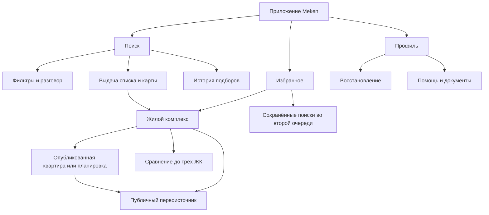

# План развития агрегатора ЖК Meken

Подготовлен 5 октября 2026 года; зарубежные источники изучены 4–5 октября. Статус: предложение для планирования, функции ниже не считаются реализованными.

Зафиксированная модель по уточнению пользователя: **Meken агрегирует сведения о ЖК и использует только открытые, публично доступные данные**. Контент поступает из публичных страниц, открытых методов API и опубликованных наборов данных. Для работы не требуются договорные каналы, доступ в CRM, личные кабинеты или внутренние системы застройщиков.

Предлагаемый первый рынок — покупатели новостроек в Астане; iOS и Android используют существующий backend. Закрытый пилот проводится на русском языке. Казахский интерфейс, ошибки и качество понимания запросов входят в отдельную очередь проверки. Город, аудиторию и размер команды нужно подтвердить перед назначением сроков. Поддержка пяти городов в конфигурации одного источника сама по себе не означает достаточное покрытие каждого рынка.

Рекомендация: развивать Meken как независимый агрегатор для поиска и сравнения ЖК разных застройщиков. Главная сущность — жилой комплекс. Корпуса, типы планировок и конкретные квартиры доступны как вложенные уровни только там, где их публикует источник. Пользователь изучает собранные факты, сравнивает ЖК и переходит на первоисточник. Разговор помогает находить и объяснять эти сведения.

## Задача продукта и первый рынок

Предлагаемая аудитория первого пилота — человек или семья, которые покупают квартиру для проживания, уже представляют бюджет и выбирают между несколькими ЖК. Это гипотеза для интервью, а не установленный результат исследования покупателей.

Главная задача: за один сеанс получить 2–3 подходящих ЖК, понять различия и следующий шаг. Пример: «Ищу ЖК в Астане с двухкомнатными квартирами до 35 млн ₸, важна действующая школа рядом». Приложение показывает найденные публичные сведения и отдельно объясняет, какие условия подтверждены на уровне ЖК, типа планировки или конкретного лота. Публичная цена «от» сама по себе не подтверждает наличие двухкомнатной квартиры в бюджете.

Предлагаемое обещание продукта: «ЖК разных застройщиков в одном месте — с удобным поиском, сравнением и ссылками на источники». Свежая публикация подтверждает сведения источника на момент наблюдения; фактическое наличие, персональную цену и условия сделки пользователь уточняет у застройщика.

Основные сценарии первого выпуска:

1. Быстро найти ЖК разных застройщиков через фильтры или разговор, без обязательной регистрации.
2. Изучить расположение, параметры, публичные цены, сроки и инфраструктуру ЖК, сохранив условия поиска.
3. Сравнить до трёх ЖК по сопоставимым фактам и сохранить короткий список.
4. Открыть первоисточник; изучить опубликованные планировки или квартиры, если они доступны.
5. Вернуться к подборке позже, в том числе после потери сети или смены устройства, если сервер поддерживает восстановление.

На следующем этапе добавляется возвращающий сценарий: сохранить условия и узнать о новых ЖК или изменениях их публичных сведений. Совместный выбор остаётся возможным развитием. Заявки, запись на просмотр, бронирование и обработка сделки не входят в модель агрегатора.

## Что уже есть в проекте

Ниже — результаты чтения локального кода и документов. В рамках составления плана приложения, production API и платная модель не запускались.

| Область | Имеющаяся основа | Работа для нового продукта |
|---|---|---|
| Мобильные клиенты | Нативные iOS и Android; вкладки «Подбор», «Избранное», «О приложении» | Развить поиск и контекстные экраны на обеих платформах |
| Подбор | Разговор, быстрые запросы, карточки, SSE, уточнения и остановка | Добавить отдельную выдачу и согласованное состояние списка, карты и разговора |
| Фильтры | Город, бюджет, комнаты, инфраструктурные приоритеты; backend поддерживает площадь и этажи | Выровнять iOS и Android; новые фильтры добавлять после проверки полей источника |
| Квартира | Планировка или изображение, цена, параметры, источник, дата, проверка наличия, ссылка | Улучшить иерархию; связать квартиру с полноценной страницей ЖК |
| Карта | iOS: маркер ЖК в детали; Android: внешняя geo-карта | Нужна карта всей выдачи и серверный отбор по области |
| Сравнение | Выбор 2–3 квартир и объяснение в текущем разговоре | Сделать читаемую таблицу фактов, сохранив исходное объяснение |
| Избранное и история | Серверное избранное квартир, кеш, история диалогов | Добавить избранные ЖК в P0; заметки и сохранённые условия позже |
| Данные | Специализированный адаптер BI Group, generic feed, факты инфраструктуры со статусами | Реестр публичных источников, сбор ЖК разных застройщиков, нормализация и обновление |
| Возвращение и переходы | Внешняя ссылка застройщика, базовое восстановление сессий | Подписки, push и семейная подборка — новые функции; заявки и календарь не требуются |
| Аналитика | Технические метрики запросов, модели и поставщиков | Добавить измерение пользовательского пути |

Таблица описывает существующий код. Его действие «проверка наличия» читает сведения источника и не устанавливает фактическую доступность для сделки; в новой модели пользовательское действие формулируется как обновление публичных сведений.

В текущем `/search` нет полноценного cursor/total для каталога; выдача ограничена, сортировка фиксирована. Каталог, карта, новые фильтры и страницы ЖК требуют отдельной работы над контрактом, а не только новых макетов.

Основные локальные источники: [корневая навигация iOS](../ios/Meken/App/MekenApp.swift), [навигация Android](../android/app/src/main/java/kz/unknown/meken/ui/MekenApp.kt), [API](../backend/app/api/routes.py), [схемы](../backend/app/domain/schemas.py), [каталог](../backend/app/services/catalog.py), [модели](../backend/app/domain/models.py), [интеграции](INTEGRATIONS.md).

Состояние выпуска по наиболее свежим документам: подписанные IPA и AAB подготовлены; загрузка и публикация в магазинах не выполнены. Новый backend с миграциями 0007/0008 подготовлен локально, но не выкатан; восстановление профиля показывается по capabilities сервера. ИИ по документам выключен. Эти сведения взяты из [мобильной архитектуры](MOBILE_ARCHITECTURE.md) и [развёртывания](DEPLOYMENT.md), текущая удалённая среда в этом исследовании не проверялась. Старые пункты README/VERIFICATION не следует использовать как единственный реестр готовности.

Также уже есть [спецификация девяти экранов редизайна](../.frontend-workbench/sessions/meken-mobile-redesign-20261004/product-design/design-spec.md). Она не внедрена. Её визуальную систему и существующие сценарии можно использовать; каталог, страницы ЖК и уведомления в этом плане расширяют продукт и требуют собственных спецификаций.

## Практики зарубежных продуктов

Изучены официальные страницы функций и справки. Они подтверждают описанные возможности и правила отдельных продуктов, но не доказывают их эффективность, полный текущий интерфейс или доступность во всех версиях приложений. Для Meken используются подходы к поиску, сравнению и возвращению. Способы получения данных зарубежными сервисами не исследованы как основание для нашей модели; доступ к их партнёрским каналам и процессы сделок не переносятся. Решения для Meken в последнем столбце — рекомендации.

| Продукт и рынок | Что подтверждено официальным источником | Предлагаемая адаптация |
|---|---|---|
| Redfin, США | Разговорный поиск встроен в поиск жилья и позволяет уточнять пожелания. [Описание функции](https://www.redfin.com/news/conversational-search-is-now-available-on-the-redfin-iphone-app/) | Единые условия для разговора и фильтров; пользователь видит и исправляет распознанные параметры |
| Zillow, США | Поиск по месту, фильтрам и нарисованной области карты. [Справка iPhone](https://zillow.zendesk.com/hc/en-us/articles/360000808587-How-do-I-search-for-homes-on-the-Zillow-mobile-app-iPhone) | Список и карта одной выдачи; сложное рисование зон отложить до достаточного наполнения |
| Rightmove, Великобритания | Сохранённые поиски, уведомления о новых объектах и снижении цен, управление частотой. [MyRightmove](https://faq.rightmove.co.uk/support/solutions/articles/7000048780-what-can-i-do-with-a-myrightmove-account-) | Сохранять структурированную потребность отдельно от истории разговора; уведомлять после внедрения истории наблюдений |
| idealista, Европа | Сохранение поиска с названием, мгновенные и ежедневные уведомления. [Справка](https://www.idealista.com/ayuda/articulos/how-to-subscribe-to-the-alerts-service/?lang=en) | Кнопка «Сохранить поиск» после полезной выдачи; редактирование, пауза и удаление подписки |
| idealista, Португалия | Поиск по нарисованной зоне и общие списки избранного с просмотром либо совместным редактированием. [Приложение](https://www.idealista.pt/aplicacoes) | Сначала поделиться карточкой; затем общая подборка с отдельными правами участников |
| PropertyGuru, Сингапур | Отдельный каталог новых проектов с параметрами и сроками; карточки связаны с инфраструктурой и типами квартир. [Каталог проектов](https://www.propertyguru.com.sg/new-project-launch), [пример проекта](https://www.propertyguru.com.sg/listing/project/for-sale-the-myst-500205045) | Отдельные сущности ЖК, корпуса и квартиры; сроки и цены привязаны к нужному уровню |
| PropertyGuru, Сингапур | Verified Listing имеет конкретные условия проверки и срок действия. [Правила](https://www.agentofferings.propertyguru.com.sg/help-centre/manage-your-listings/verify-listing/verified-listings/) | Указывать, где сведения опубликованы и когда прочитаны; партнёрскую верификацию не переносить как значок безопасности |
| PropertyGuru, Малайзия | Предложения имеют статусы и срок действия; истёкшее объявление скрывается у покупателя. [Listing management](https://myagentofferings.propertygurugroup.com/help-centre/welcome-to-agentnet/tools-to-help-you-win/all-about-listing-management/) | Управлять устареванием каталога; сбой загрузки не считать продажей квартиры |

Вывод для Meken: потребность → поиск ЖК → изучение → сравнение → избранное → переход к первоисточнику. Сохранённый поиск и уведомления помогают вернуться к выбору. Это адаптация выбранных практик к независимому агрегатору публичных сведений.

У местного конкурента уже есть карта с рисованием зоны, подписка, сведения о районе и избранное: [официальный обзор Krisha](https://krisha.kz/content/news/2024/2024-top-5-poleznyh-funkciy-krisha-kz). Его раздел новостроек описывает фото, планировки, застройщика и документы: [обзор сервисов](https://krisha.kz/content/news/2025/2025-krisha-kz-izmenilas-poleznye-servisy-teper-pod-rukoy). Поэтому наличие этих экранов само по себе не создаёт преимущества. Гипотеза отличия Meken — удобное сопоставление ЖК разных застройщиков, прозрачные источники и компромиссы, меньше ручного просмотра сайтов. Её нужно проверить на покупателях.

## Навигация и карта страниц

В первом пилоте достаточно трёх нижних вкладок: **Поиск / Избранное / Профиль**. Карта — режим поиска, ЖК и квартира — вложенные страницы, разговор — контекст поиска. История открывается из поиска. Так человек сохраняет место в выдаче и условия при переходах.

Карта входит в пилот только после проверки координат и соответствия географического отбора на обеих платформах. Предлагаемое условие: не менее 95% ЖК пилотного каталога имеют проверенное расположение; точка офиса продаж не подменяет адрес жилья. Долю и выборочную проверку участвующих ЖК фиксирует T01. Это целевой порог плана, а не измеренный результат. Объекты без координат остаются в списке с явным указанием неполноты; неизвестное расположение не считается попаданием в выбранную область.

Если условие не выполнено, выпустить пилот со списком и корректным внешним открытием доступного адреса, а карту перенести в P1 и скрыть её переключатель. Пилотный API и приёмка тогда не требуют отбора по области. Это не должно задерживать проверку самого подбора. Перечень экранов ниже описывает целевой пилот при прохождении этой проверки.

После внедрения сохранённых поисков их раздел размещается внутри «Избранного». Отдельную четвёртую вкладку «Обновления» вводить лишь при регулярном полезном потоке событий. Пустые разделы будущих функций в первой версии не нужны.

## Состав экранов первого пилота

Это перечень поверхностей продукта, а не требование сделать каждую отдельной вкладкой. Полный поиск работает и при выключенном ИИ через форму и явно обозначенный базовый режим.

| Экран | Назначение и содержание | Основное действие | Состояния и граница первой версии |
|---|---|---|---|
| 1. Первый запуск | Короткое объяснение, выбор города, реальное покрытие; вход без анкеты | Начать поиск | Пилот RU; геолокация необязательна; отказ не блокирует выбор города |
| 2. Поиск | Город, район, бюджет, быстрые примеры, прежний поиск, вход в разговор | Найти ЖК | Понятен базовый режим; видны покрытие и источники |
| 3. Фильтры | Застройщик, район, опубликованные сроки/стадия, ценовые сведения, инфраструктура; параметры квартир при наличии данных | Показать ЖК | Цена «от», тип планировки и цена лота различаются; неизвестные условия не считаются подтверждёнными |
| 4. Результаты | ЖК разных застройщиков: расположение, публичная цена или отсутствие цены, сроки по источнику, дата наблюдения | Открыть / сохранить / сравнить ЖК | Пагинация, частичная выдача, пусто, ошибка; условия не ослабляются скрытно |
| 5. Карта результатов | Маркеры ЖК, краткая карточка, поиск в выбранной области | Открыть ЖК | Не требуется GPS; совпадают условия карты и списка; неизвестные координаты явно учитываются |
| 6. Разговор | Сообщения, редактируемые условия, карточки, уточняющие вопросы и объяснения со ссылками | Уточнить подбор | Загрузка, остановка, обрыв, повтор; несохранённый запрос не дублируется |
| 7. Жилой комплекс | Название, застройщик, адрес, корпуса/очереди, сроки/стадия, инфраструктура, документы; опубликованные типы/лоты при наличии | Сохранить / сравнить / открыть первоисточник | У каждого факта источник/дата; цена «от» не выдаётся за цену конкретной квартиры; неполный контент допустим |
| 8. Квартира или планировка | Только опубликованные сведения: планировка, площадь, комнаты, этаж/цена/статус при наличии; привязка к корпусу | Обновить публичные сведения / открыть первоисточник | Тип без лота обозначен явно; обновление источника не гарантирует фактического наличия |
| 9. Сравнение ЖК | 2–3 ЖК: расположение, застройщик, сроки корпуса, отделка, инфраструктура, сопоставимые публичные цены, источники и свежесть | Открыть или сохранить ЖК | Цена «от» не смешивается с ценой лота; неизвестные поля видны; прежнее сравнение квартир сохраняется при наличии лотов |
| 10. Избранное | Сохранённые ЖК, опубликованные квартиры и быстрый выбор для сравнения соответствующего уровня | Вернуться к выбору | Кеш без сети явно обозначен; снятая публикация остаётся читаемой с новым статусом |
| 11. История | Прежние диалоги и условия, открытие и удаление подборки | Продолжить поиск | История не равна подписке; удаление диалога не удаляет избранное |
| 12. Профиль и восстановление | Устройство/сессия, перенос профиля при capability, управление данными | Восстановить / удалить данные | Выбор языка после готовности KZ; код и последствия объяснены; недоступная серверная возможность скрыта |
| 13. Помощь и документы | Поддержка, сведения о покрытии и источниках, privacy/terms, сообщение об ошибке объекта | Получить помощь / сообщить ошибку | Ответственный канал поддержки существует до распространения пилота |

Если полноценной галереи или сведений о ходе строительства нет у источника, первая версия показывает доступную планировку и факты. Макет не должен создавать впечатление, что эти материалы уже получены.

## Функции второй очереди

| Функция или страница | Польза | Условие начала |
|---|---|---|
| Сохранённые поиски | Название, точные условия, редактирование и пауза | Версионируемая модель критериев, независимая от диалога |
| Обновления и push | Новые ЖК и изменения публичных сведений; события по лотам только при публикации конкретных лотов | История сопоставимых наблюдений, дедупликация, частота; сообщение содержит источник, дату и тип цены, без подтверждения фактического наличия |
| Заметки | Организовать короткий список и вопросы к застройщику | Избранные ЖК уже в P0; личные заметки требуют отдельной модели |
| Поделиться ЖК или квартирой | Отправить безопасную ссылку партнёру; открыть карточку без доступа к чужому профилю | Стабильные ссылки и веб-страница для получателя без установленного приложения |
| Совместная подборка | Партнёр видит выбранные объекты и добавляет комментарии | Права доступа, приглашение и отзыв доступа; отдельная область от личной истории |
| Страница застройщика | Проекты, официальные контакты и сведения с источниками | Устойчивое сопоставление поставщика и проверенные материалы |
| Расчёт бюджета | Посчитать платёж по введённым пользователем ставке, сроку и взносу | Проверенная математика и явное обозначение предварительного расчёта |
| Район и важные места | Изучить окружение и доступность работы/школы | Достаточные POI, координаты, лицензии геоданных и маршрутов |
| Казахская локализация | Интерфейс, ошибки, помощь и сценарии для KZ пользователей | Редактура носителем, QA на обеих платформах; понимание свободных запросов оценивается отдельно |

Рисование зоны, время поездки, история цены и аналитика рынка вводятся по готовности данных. Цена предложения одного застройщика не является ценой сделки или оценкой всего рынка. Показывать заранее рассчитанный «платёж от» без актуальных условий и полной базы расчёта не следует.

## Поиск и правила работы с фактами

**Единые условия.** Форма, разговор, выдача и карта используют одну структуру критериев. Пользователь видит обязательные параметры и может исправить распознанный бюджет/город. «Рядом со школой» требует уточнения радиуса и состояния школы; неизвестное состояние не удовлетворяет обязательному условию. При отсутствии результатов предлагаются отдельные изменения с видимыми последствиями.

**Разделение уровней.** ЖК содержит корпуса/очереди; квартира относится к опубликованному конкретному предложению. Тип планировки не доказывает наличие лота. Диапазоны комнат и площадей не доказывают существование каждой комбинации. Срок всего проекта не подставляется автоматически вместо срока корпуса. Публичная цена «от», диапазон, цена за м² и точная цена лота хранятся раздельно. Маркер показывает тип опубликованной цены и её источник; число квартир появляется только при наличии списка лотов.

**Сопоставимость и фильтры.** Для строгого бюджета и параметров квартиры нужны соответствующие опубликованные сведения, а не минимальная цена другой планировки. Если таких сведений нет, ЖК можно предложить отдельно как вариант для уточнения с явным указанием неполноты. Его нельзя помечать полностью соответствующим обязательным условиям. В сравнении ЖК цены разных типов не подставляются в одну строку без пояснения.

**Свежесть.** Сохраняются время наблюдения источника и время получения; дата публикации хранится отдельно, если указана. Повторное чтение кеша не обновляет дату проверки. Неуспешный сбор, пропажа страницы и отсутствие лота не доказывают продажу. Возраст данных, ошибка извлечения и неизвестный статус отображаются раздельно. Действие «Обновить сведения» повторно читает публичный источник; оно не проверяет фактическое наличие в системе продаж.

T01 фиксирует отдельные правила для опубликованных цен/статусов, сведений ЖК и инфраструктуры: частоту наблюдений, предельный возраст, поведение при исчезновении страницы/объекта, полном и частичном сборе. Сначала проверить существующую логику, затем изменить недостаточную часть. Частота определяется допустимым доступом и реальной изменчивостью источника, проверяется серией наблюдений. Свежесть сбора и достоверность заявлений источника остаются разными свойствами.

**Дубли и противоречия.** Для ЖК нужен внутренний ID и связи с записями источников. Название, застройщик, адрес, корпус и координаты участвуют в сопоставлении; сомнительные совпадения требуют проверки. Корпуса разных очередей не объединяются только по названию. Противоречащие цены или сроки сохраняются с источниками и датами; не выбирается молча самая низкая цена. Смена структуры страницы или внезапно пустой ответ сохраняют последнее наблюдение с признаком устаревания и создают операционную ошибку.

**Инфраструктура.** Действующее, строящееся, планируемое и неизвестное — разные состояния. «Рядом», «в ЖК» и «в бигвилле» не объединяются. Расстояние по прямой обозначается именно так; время маршрута появляется только при расчёте маршрута. Наличие школы не доказывает наличие мест или принадлежность адреса к её участку.

**Документы.** У каждого документа — вид, источник, дата и точный проект/корпус. КЖК направляет покупателей к Жилищному порталу для проверки застройщика и сведений о гарантиях/разрешениях: [информация для дольщиков](https://khc.kz/ru/equity/), [публикация КЖК](https://khc.kz/ru/press-center/news/4129/). В пилоте достаточно ссылки на официальный сервис и честного статуса «нет данных в Meken». Автоматический статус требует проверенного сопоставления и актуализации; отсутствие записи в приложении не означает отсутствие документа. Материалы и способ их публикации проверяются с профильным специалистом до публичного распространения.

**ИИ.** Публичные цены/статусы, расчёты и строгие фильтры проверяются кодом. ИИ понимает пожелания и объясняет найденные факты с источниками, не восполняя неизвестные значения. Перед включением — оценка на реальных RU/KZ сценариях, включая неверный город, пустую выдачу, неизвестную инфраструктуру, конфликт источников и отказ модели. Если KZ ещё не проверен, не обещать понимание произвольного казахского текста. Язык интерфейса и качество понимания запроса проверяются отдельно.

## Данные и серверные работы

Пилот агрегатора включает реальные ЖК минимум двух независимых застройщиков, собранные из публичных источников, с измеренным покрытием и полнотой полей. Два URL одного застройщика не удовлетворяют этому условию. Текущий BI-only вариант остаётся техническим прототипом до расширения. Объём ЖК и выбор городов фиксируются после аудита; весь рынок заранее не обещается.

Порядок сбора: реестр публичных источников → адаптеры чтения → сохранение исходного свидетельства → извлечение и проверка → нормализация ЖК/корпусов → сопоставление дублей → публикация фактов со ссылками и датами. Предпочитать устойчивый открытый API или опубликованный набор; для страниц использовать доступное публичное содержимое. Частота, объём чтения и повтор при сбое ограничены. Вход в приватные кабинеты, обход ограничений и отправка бизнес-запросов не входят в сбор.

| Направление | Что сделать | Проверяемый результат |
|---|---|---|
| Каталог | Пагинация, стабильная сортировка, число результатов; географическая область при включении карты | Переходы по страницам не создают дублей; применены правила свежести; условия карты и списка совпадают при её включении |
| Источники | Реестр URL, публичный способ чтения, доступные поля, расписание и адаптеры | В каталоге представлены разные застройщики; ошибки сбора обнаруживаются без уничтожения данных |
| ЖК | Нормализовать ЖК/корпуса и необязательные типы/лоты; сопоставить записи источников | Дубли не завышают число ЖК; неизвестные связи и противоречия видны |
| Контент | Извлечь публичные адреса, координаты, сроки, цены, планировки и ссылки на документы | У каждого факта URL, дата наблюдения и тип значения; неизвестные поля не придуманы |
| Фильтры | Согласовать текущие поля между платформами; расширять после data audit | Один и тот же запрос даёт одинаковую семантику на iOS/Android |
| Изменения | История публичных цен/статусов, привязанная к тому же источнику и типу предложения | Смена «цены от» на цену лота не создаёт событие снижения; повтор сбора не создаёт уведомление |
| Подписки | Независимые сохранённые условия, device push registration, настройки | Пауза/удаление прекращают рассылку; без разрешения push поиск продолжает работать |
| Аналитика | События поиска, просмотра, сохранения, сравнения и выхода к источнику | Можно измерить путь пользователя без сохранения полного текста личных пожеланий в аналитике |

Использовать текущие FastAPI/PostgreSQL/worker, native-клиенты и контракт `/v1`. Разработка нового приложения не требует заранее переписывать всё на другом стеке. Новые сущности добавляются по выбранной очереди. Для read-only административного просмотра стоит оценить существующий framework или защищённые операционные отчёты перед созданием собственной панели.

Для каждого источника фиксируется доступный способ использования и публикации материалов. Открытый доступ не обозначается автоматически как открытая лицензия. Если возможность воспроизведения материала не установлена, использовать проверяемую ссылку на оригинал; подключение источника не должно зависеть от закрытого feed или доступа в систему продаж.

## Операционные и веб страницы

В пилоте часть операций может выполняться через существующие команды и отчёты. Отдельная большая админка не является обязательным условием первого запуска. Следующие функции должны иметь владельца и проверяемую процедуру:

| Поверхность | Минимум для пилота | Когда нужна полноценная страница |
|---|---|---|
| Состояние источников | Последний успешный импорт, возраст данных, ошибки, число объектов | Несколько источников или ежедневная работа оператора |
| Качество ЖК | Нет координат/срока/планировки, неверная связь корпуса | Регулярное исправление контента с историей изменений |
| Ошибки пользователей | Принятые сообщения по ID объекта и очередь ответа | Объём обращений требует поиска, статусов и назначения ответственного |
| Дубли и конфликты | Неоднозначные совпадения ЖК, различия сроков/цен, решения по сопоставлению | Несколько источников дают постоянную очередь разборов |
| Расходы и доступность | Лимиты ИИ, ошибки, задержки, backup/restore | Постоянная эксплуатация и расширение команды |

Внешний веб-минимум: страница продукта со ссылками на магазины, политика данных, условия, поддержка и инструкция удаления данных. Проверить и обновить существующие страницы в `infra/public/`. Во второй очереди — публичные страницы квартир/ЖК для share links и перехода в приложение. Веб-каталог для SEO имеет смысл после устойчивого контента и спроса; его оценка не входит в сроки мобильного пилота.

## Очереди реализации

Сначала выпускается ограниченный пилот с закрытым набором приглашённых покупателей. Набор функций ниже — предложение, которое пересматривается после интервью и проверки покрытия.

| Приоритет | Объём | Что подтверждает готовность |
|---|---|---|
| P0 перед пилотом | ЖК разных застройщиков из публичных источников; сбор/нормализация/дубли; фильтры; выдача; страница ЖК; карта при готовности; сравнение и избранные ЖК; история; переход к оригиналу; поддержка и выпуск | Покупатель самостоятельно находит 2–3 ЖК → сравнивает → открывает первоисточник; известны охват, происхождение и возраст сведений |
| P1 после первых наблюдений | Сохранённые поиски, уведомления о публичных изменениях, заметки, share links, расширение открытых источников | Есть полезное событие для возвращения, доставка без дублей и подтверждённое расширение выбора |
| P2 после спроса и готовности данных | Общие подборки, предварительный калькулятор, район/маршруты, расширенные инструменты качества данных | Каждая функция опирается на необходимые публичные сведения и проверяемую методику |
| Дальнейший рост | Веб-каталог, другие города, аналитика опубликованных предложений | Отдельная оценка спроса, источников и стоимости поддержки |

Подача объявлений продавцами, обработка заявок, запись на просмотр, оплата, бронь, ипотечная заявка, чат с менеджерами и юридический скоринг исключены из текущего плана. Следующий внешний шаг — переход на публичную страницу или опубликованный контакт застройщика.

## План работ и сроки

Оценка предполагает двух разработчиков, которые совокупно закрывают сбор данных/backend, SwiftUI и Compose, с дизайнером и QA на части времени. После уточнения модели предварительный ориентир до завершения пилота — 10–14 недель: сбор нескольких публичных источников и новая модель ЖК входят в P0. Это ориентир по объёму, не обещание даты; прежние 8–10 недель не включали такой объём агрегации. Оценку уточнить после проверки источников и проектирования контрактов. Восстановление production и рассмотрение магазинами могут влиять на календарь отдельно.

| Этап | Ориентир по календарю | Работы | Результат и ответственный |
|---|---|---|---|
| 0. Продукт и данные | Неделя 1 | 8–12 интервью; реестр публичных источников разных застройщиков; аудит полей/охвата, координат и правил свежести | Владелец продукта: аудитория, сценарий сравнения ЖК, источники пилота и решение по карте |
| 1. Спецификация | Недели 1–2 | Карта экранов, кликабельный прототип, состояния; API каталога/ЖК; выравнивание фильтров | Дизайнер и разработчики: утверждённый пилотный объём, контракты, проверка прототипа на 5 покупателях |
| 2. Агрегация | Недели 3–5 | Адаптеры публичных источников, нормализация ЖК/корпусов, источник каждого поля, дубли, ошибки и расписание | Разработчики: воспроизводимый каталог минимум двух независимых застройщиков |
| 3. Основной путь | Недели 4–8 | Выдача ЖК, страница ЖК, условная карта, сравнение/избранные ЖК, вложенные публикации квартир, внешний переход | Разработчики: сквозной путь на iOS и Android; частично параллельно этапу 2 |
| 4. Готовность пилота | Недели 9–10 | История/recovery, аналитика, поддержка, поломки страниц/конфликты, офлайн, восстановление и выпуск | Разработчики и QA: реальные сценарии и актуальный реестр готовности |
| 5. Закрытый пилот | Недели 11–14 | 20–30 покупателей; наблюдение за сравнением ЖК; исправление препятствий; оценка покрытия | Владелец продукта и QA: решение о P1 по результатам пользования |
| 6. Возвращение и расширение | Дополнительно 3–5 недель после решения | Подписки, история публичных изменений, push, заметки/share; следующие источники | Проверенная польза возвращения и самостоятельный аудит новых источников |

Для одного разработчика предварительный ориентир — 18–26 недель; если он не владеет обеими мобильными платформами, нужен отдельный специалист или пересмотр очередности платформ. Задачи не полностью параллельны: страницы и сравнение ЖК зависят от публичных данных, push — от истории сопоставимых изменений.

В первой версии страницы района, сложная галерея и полноценная админка исключены из календарной оценки. KZ локализация оценивается отдельно после инвентаризации строк и контента; её объём не включён в сроки RU-пилота и автоматически не помещается в этап 6. Другие города подключаются после повторения data audit и проверки реального сценария по каждому городу.

## Первый список задач для разработки

| Задача | Приоритет | Зависимость | Критерий приёмки |
|---|---|---|---|
| T01. Реестр публичных данных | P0 | Нет | URL разных застройщиков, способы чтения/использования, поля/пороги покрытия, правила свежести/исчезновения; решение по карте на уровне ЖК |
| T02. Интервью и проверка позиционирования | P0 | Доступ к покупателям | Определены основные препятствия; подтверждено или пересмотрено обещание подбора |
| T03. Прототип основного пути | P0 | T01, T02 | 5 пользователей находят и сравнивают ЖК; каждое неизвестное поле имеет состояние |
| T04. Модель и API каталога ЖК | P0 | T01 | Канонические ЖК/корпуса, происхождение полей, публичные цены разных типов, пагинация/сортировка/свежесть; область при включении карты |
| T05. Фильтры обеих платформ | P0 | T01, T04 | Застройщик/район/срок/стадия и цена корректны; комнаты/площадь/этаж применяются на опубликованном уровне; одинаковая семантика |
| T06. Список и страница ЖК | P0 | T03, T04, T15 | Представлены разные застройщики, нет дублей; открываются правильные ЖК и публичные вложенные публикации |
| T07. Карта той же выдачи | P0 при готовности данных, иначе P1 | T04, качество координат | Область карты ограничивает результаты; кластер раскрывается; отсутствие GPS не блокирует поиск; при провале проверки карта исключена из пилота |
| T08. Сравнение и избранные ЖК | P0 | T01, T03, T04 | До 3 ЖК, сопоставимые публичные факты, неизвестные значения/конфликты видны; сохранение ЖК; прежнее сравнение квартир не теряется |
| T09. Переход к источнику и помощь | P0 | Проверенные URL, канал поддержки | Открывается нужный объект; переход измеряется как намерение, а не совершённый контакт/покупка |
| T10. Аналитика пилота | P0 | Модель событий | Можно построить воронку и отличить сбой/пустую выдачу; личный текст не копируется в telemetry |
| T11. Актуальный реестр выпуска | P0 | Текущие release docs | Указаны готовность кода, серверных capabilities, сборок и магазинов; расхождения старых документов устранены |
| T12. Пилот и проверка восстановления | P0 | T06, T08–T11, T15; T07 при включении карты | Сквозное сравнение ЖК разных застройщиков, ошибки публичного сбора, изолированное восстановление и мобильные клиенты проверены |
| T13. Сохранённые критерии | P1 | T04, наблюдения пилота | Можно переоткрыть/изменить поиск независимо от сообщения и истории |
| T14. История изменений и уведомления | P1 | T13, регулярное обновление | Нет ложного снижения цены, повторных уведомлений и рассылки после паузы |
| T15. Публичная агрегация разных застройщиков | P0 | T01, T04 | Минимум два независимых застройщика из общедоступных источников; адаптеры, расписание, нормализация/дубли, происхождение полей и ошибки проверены |
| T16. Казахский интерфейс и сценарии | P1, отдельная оценка | Инвентаризация контента, носитель языка | Переведены строки/ошибки/помощь, проверены обе платформы; качество ИИ на KZ подтверждается отдельным eval |

Задачи описывают ожидаемый результат. T15 выполняется перед пилотом, несмотря на сохранённый номер задачи. Перед постановкой в трекер разделить работы по сбору данных, backend, iOS и Android; оценку уточнить после T01/T03/T04. Этот документ не создаёт задачи во внешнем трекере.

## Проверки перед распространением пилота

1. На обеих платформах пользователь без помощи находит ЖК разных застройщиков, изучает, сравнивает и сохраняет 2–3 ЖК, затем открывает первоисточник. Обязательного наличия квартирных лотов нет.
2. При включённой карте её условия согласованы со списком, запрос без точных координат обработан явно. Если проверка координат не пройдена, карта и её переключатель исключены из пилота. Пустая выдача не меняет бюджет молча.
3. Публичная цена «от» не выдаётся за точную цену лота. Заявленный статус сопровождается источником/датой; исчезнувшая публикация не считается проданной. Сохранённая карточка объясняет неполноту.
4. Сбой публичного API, смена структуры HTML, пустой ответ, дубли и конфликт фактов проверены. Последнее наблюдение сохраняется с возрастом; отключение ИИ/сети проверено отдельно; повтор не создаёт дублей.
5. Равенство фильтров и восстановление профиля проверены между iOS/Android и версиями API. Функция включается по capabilities.
6. Крупный шрифт, screen reader, тёмная тема, отсутствие изображения и небольшие экраны проверены на готовом интерфейсе.
7. Свежая отдельно сохранённая резервная копия и восстановление в изолированную среду проверены до необходимого обновления production. Текущий статус и действия определяются [BACKUPS.md](BACKUPS.md), а не предполагаются из готового скрипта.
8. IPA/AAB, сведения магазинов, privacy/terms, поддержка и обработка удаления соответствуют фактическому приложению. Готовый архив не означает публикацию.

Планирование не включает выполнение production backup, выкатку, включение платной модели или публикацию. Эти работы оформляются как отдельные конкретные действия выбранного релиза. Отправка пользовательских контактов застройщикам в модель агрегатора не входит.

## Метрики и решение после пилота

Основная метрика первого этапа — доля участников с запросом внутри реального покрытия, которые самостоятельно собрали короткий список ЖК разных застройщиков и поняли различия по публичным сведениям. Число сообщений модели не измеряет качество выбора.

События: `search_started`, `criteria_applied`, `results_viewed`, `project_opened`, `listing_opened`, `favorite_added`, `comparison_opened`, `source_opened`, `search_saved`, `notification_opened`. Перед передачей внешней аналитике согласовать минимальный набор полей и обработку пользовательских данных.

| Что измерить | Зачем | Предлагаемый ориентир пилота |
|---|---|---|
| Прохождение основного пути | Понять удобство приложения | Не менее 80% из 5 участников проверки прототипа выполняют задачу без подсказок; затем повторить на рабочем приложении |
| Время до 2–3 полезных ЖК | Проверить обещание экономии усилий | Медиана до 5 минут на сценариях внутри доступного покрытия |
| Запросы без подходящих результатов | Разделить нехватку каталога, чрезмерные ограничения и ошибки | Классифицировать все такие случаи в пилоте; единого порога до замера нет |
| Точность извлечения и сопоставления | Проверить факты и принадлежность к ЖК | До 30 ЖК разных застройщиков, либо весь каталог, если меньше: сверить с публичными источниками; отдельно проверить лоты, если опубликованы; это не проверка фактического наличия |
| Переход к источнику | Видеть намерение следующего действия | Измерить базовую долю; клики не считать завершённой заявкой или покупкой |
| Возвращение к сохранённому | Оценить P1 подписок/уведомлений | Смотреть отдельно по продолжающим выбор; завершивших покупку не считать провалом удержания |
| Ошибки и расходы | Решить, можно ли расширять пилот | Измерить на реальных устройствах и источнике; SLO и бюджет назначить по результатам |

Численные ориентиры выше предложены для планирования, не взяты из статистики зарубежных продуктов. Пилот 20–30 человек даёт направляющие наблюдения, не доказательство массового спроса.

Если покупатели выбирают по другому критерию, изменить гипотезу до наращивания функций. Если запросы пусты из-за малого охвата, приоритет — новые открытые источники. Если каталог достаточен, но человек не понимает различий, приоритет — карточка ЖК и сравнение. Если публичные сведения противоречивы или устарели, сначала улучшить извлечение, обновление и атрибуцию; фактическое наличие агрегатор не обещает. Уведомления не устраняют эти причины.

## Монетизация и границы роста

Модель монетизации пока не выбрана. После проверки полезности можно исследовать готовность платить за расширенные пользовательские инструменты: организацию подборок, наблюдение за изменениями и отчёты по сопоставимым публичным данным. Это гипотезы, не обязательный объём разработки и не подтверждённый доход.

Если позже рассматривается реклама, размещение явно маркируется и не подменяет соответствие условиям поиска. Источники основного каталога остаются публичными; подключение ЖК не зависит от оплаты. Обработка квалифицированных лидов и комиссия за сделку не являются основой текущего плана.

Главные риски: малое покрытие ЖК, неполнота публичных полей, дубли, противоречия, изменение сайтов/методов API, стоимость поддержки сбора и переоценка роли ИИ. Каждый риск привязан к проверке выше, чтобы результат исследования менял следующую работу.

## Ближайшее действие

Начать с T01–T03: выбрать публичные источники разных застройщиков, измерить доступные поля, провести интервью и подготовить прототип поиска ЖК → карточка ЖК → сравнение → первоисточник. Затем оценить модель ЖК и адаптеры T04/T15, назначить задачи на обе платформы. Конкретные квартиры включаются только при наличии опубликованных лотов; новые функции не требуют закрытых данных или процессов застройщика.
